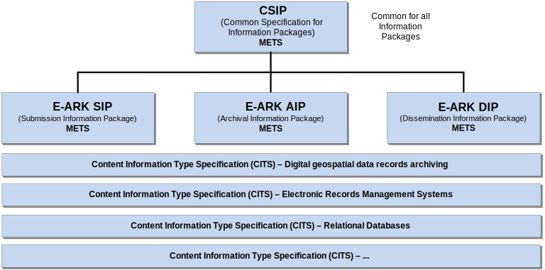

# Preface
## I. Aim of the Specification
This document is one of several related specifications which aim to provide a common set of usage descriptions of international standards for packaging digital information for archiving purposes. These specifications are based on common, international standards for transmitting, describing and preserving digital data. They also utilise the Reference Model for an Open Archival Information System (OAIS) which has Information Packages as its foundation. Familiarity with the core functional entities of OAIS is a prerequisite for understanding the specifications.

The specifications are designed to help data creators, software developers and digital archives to tackle the challenge of short-, medium- and long-term data management and reuse in a sustainable, authentic, cost-efficient, manageable and interoperable way.
A visualisation of the current specification network can be seen here:

**Figure I:** Diagram showing E-ARK specification dependency hierarchy.

### Overview of the E-ARK Specifications

#### Common Specification for Information Packages (E-ARK CSIP)
This document introduces the concept of a Common Specification for Information Packages (CSIP). The main purposes of CSIP are to:

- Establish a common understanding of the requirements which need to be met to achieve interoperability of Information Packages.
- Establish a common base for the development of more specific Information Package definitions and tools within the digital preservation community.
- Propose the details of an XML-based implementation of the requirements using, to the largest possible extent, standards which are widely used in international digital preservation.

Ultimately the goal of the Common Specification is to reach a level of interoperability between all Information Packages so that tools implementing the Common Specification can be adopted by institutions without the need for further modifications or adaptations.

#### Specification for Submission Information Packages (E-ARK SIP)
The main aims of this specification are to:

- Define a general structure for a Submission Information Package format suitable for a wide variety of archival scenarios, such as document and image collections, databases or geospatial data.
- Enhance interoperability between Producers and Archives.
- Recommend best practices regarding the structure, content and metadata of Submission Information Packages.

#### Specification for Archival Information Packages (E-ARK AIP)
The main aims of this specification are to:

- Define a generic structure of the AIP format suitable for a wide variety of data types, such as document and image collections, archival records, databases or geospatial data.
- Recommend a set of metadata related to the structural and the preservation aspects of the AIP as implemented by the reference implementation (earkweb).
- Ensure the format is suitable to store large quantities of data.

#### Specification for Dissemination Information Packages (E-ARK DIP)
The main aims of this specification are to:

- Define a generic structure of the DIP format suitable for a wide variety of archival records, such as document and image collections, databases or geographical data.
- Recommend a set of metadata related to the structural and access aspects of the DIP.

#### Content Information Type Specifications (E-ARK CITS)
The main aim of a Content Information Type Specification (CITS) is to:

- Define, in technical terms, how data and metadata must be formatted and placed within a CSIP Information Package to achieve interoperability in exchanging specific Content Information.

The number of possible Content Information Type Specifications is unlimited. For a list of existing Content Information Type Specifications see the relevant section in the Common Specification for Information Packages.

## II. Organisational Support
This specification is maintained by the Digital Information LifeCycle Interoperability Standards Board (DILCIS Board, <http://dilcis.eu/>). The role of the DILCIS Board is to enhance and maintain the draft specifications developed in the European Archival Records and Knowledge Preservation Project (E-ARK project, <http://eark-project.com/>) which concluded in January 2017. The Board consists of eight members, but no restriction is placed on the number of participants taking part in the work. All Board documents and specifications are stored in GitHub (<https://github.com/DILCISBoard/>) while published versions are made available on the Board webpage. Since 2018 the DILCIS Board has been responsible for the core specifications in the Connecting Europe Facility eArchiving Building Block <https://ec.europa.eu/cefdigital/wiki/display/CEFDIGITAL/eArchiving/>.

## III. Authors & Revision History
A full list of contributors to this specification, as well as the revision history can be found in the [Postface material](#postface).
